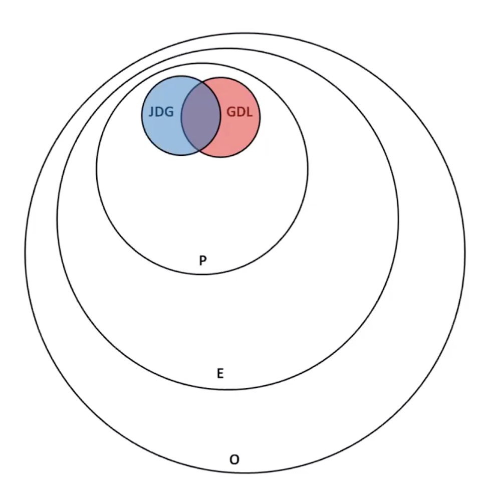

# FDH-2-5: Text Processing

#### Contents

<!-- TOC depthFrom:2 depthTo:4 withLinks:1 updateOnSave:0 orderedList:0 -->

- [1. Large textual objects](#1-large-textual-objects)
	- [1.1. Humanities Computing, Computational Linguistics and Digital Humanities](#11-humanities-computing-computational-linguistics-and-digital-humanities)
	- [1.2. Some order of magnitudes](#12-some-order-of-magnitudes)
	- [1.3. Digital databases of historical texts](#13-digital-databases-of-historical-texts)
- [2. Diachronic evolutions](#2-diachronic-evolutions)
	- [2.1. Corpus representativity](#21-corpus-representativity)
	- [2.2. n-grams](#22-n-grams)
	- [2.3. Text reuse](#23-text-reuse)
	- [2.4. Regular expressions](#24-regular-expressions)
- [3. (Synchronic) distributional approaches](#3-synchronic-distributional-approaches)
	- [3.1. TF-IDF](#31-tf-idf)
	- [3.2. Word Matrix](#32-word-matrix)
	- [3.3. From Latent Semantic Analysis to Topic Modelling](#33-from-latent-semantic-analysis-to-topic-modelling)
		- [3.3.1. Latent Semantic Analysis](#331-latent-semantic-analysis)
	- [3.4. Vector Space Models](#34-vector-space-models)
		- [3.4.1. Word embeddings](#341-word-embeddings)
		- [3.4.2. Diachronic word embeddings](#342-diachronic-word-embeddings)
	- [3.5. Multi-linguistic spaces](#35-multi-linguistic-spaces)
- [4. Conclusion](#4-conclusion)
	- [4.1. Summary](#41-summary)
	- [4.2. In the next chapter](#42-in-the-next-chapter)
- [Practice](#practice)
- [Biblio](#biblio)
- [Further reading](#further-reading)

<!-- /TOC -->

#### Theses

1) Digital Humanities is the only field to deal with large collection of digital texts originating form collective discourses, massive digitisation and/or collective transcription projects

2) These large textual objects can be processed to extract hidden regularities and structures.

3) Some of these patterns and signatures are diachronic; others are synchronic.

4) The geometry of complex meaning spaces can be reconstructed even if we stay only at the surface of textual data.  

## 1. Large textual objects

### 1.1. Humanities Computing, Computational Linguistics and Digital Humanities

Humanities Computing and Computational Linguistics were, and to some extent still are, different fields - with separate conference, societies, journals.

This can be traced back to to the origins of the two domains. Digital Humanities was initially linked with philology and literature whereas Computational Linguistics was anchored in more formal linguistics and computer science (we have see previously that both are tightly linked, in particular though the work of Chomsky, cf. FDH-1-3).

Progress in a more formal understanding of what Digital Humanities are permits to go beyond this field distinction.

We have indeed attempted to define Digital Humanities as the field dealing with large digital cultural objects, and therefore with large collections of digital texts. Again, let's stress that no other discipline can deal with these objects.

### 1.2. Some order of magnitudes

We can try to get a sense of how large the corpora under study can be by looking at some orders of magnitude:
- One page of a book contains 2000 - 3000 characters.
- A 400 page book contains between 8.10^5 and 12.10^5 characters, so roughly 10^6, a million of characters.
- If you read 1000 books in your life, you will have read 10^9, a billion characters.
- The Library of Congress contains 12.10^6 books, ie. 12.10^12 characters.

Let's consider an alphabet of 32 characters, including spaces and punctuation. (Footnote: 32 is convenient as it is roughly equal to sqrt(1000).)

Imagine now a text made of random characters:

- The character "a1" would appear on average every 32 characters.
- The sequence "a1-a2" every 32*32, roughly every 1000 characters.
- The sequence "a1-a2-a3" every 32^3 roughly 3.10^4 characters.
- The sequence "a1-a2-a3-a4" every 32^4 characters, ie. once or twice in a 400 page book.
- A 6 characters chain would appear roughly every 10^9 characters, once in a lifetime. A 9 character chain would be found once in the entire Library of Congress.

Obviously, texts are not random sequences. They possess **strong regularity**.

The study of this regularity is the subject of Linguistics. Linguistics try to describe texts in a more compact way by showing that they possess regularity, through **syntactic trees** or **grammatical transformations** (which can thus be thought of as compression algorithms).

Paradoxically, linguistics haven't been able to see objects at their full scale: language structures were only captured from extremely partial information (though enriched through observation and induction), compared to all information potentially available.

### 1.3. Digital databases of historical texts

Large collections of digital texts originate from two different source types:

1) Large **collective discourses** (Twitter, Wikipedia)

2) Collection of **historical texts** either from digitisation projects or collective transcription and editing projects.

In such cases, the text processing pipeline
- **(1)** starts with a physical document containing a text written in a given script
- **(2)** an image of that physical document is taken;
- **(3)** the text is extracted by reverse engineering the writing system;
- **(4)** extracted digital texts are then aggregated into a collection, which can then massively be analysed;
- **(5)** and they are potentially transformed into other digital objects.

Several historical text projects exist, with some based on collective editing and others favouring highly automated transcription pipelines.

These large collections of historical texts are nontheless challenging because they contain texts originating from different places and times, which have been redocumented and recontextualized several times.

#### Project Gutenberg

Project Gutenberg was founded in 1971 by Michael Hart, with the aim of creating electronic books. It contains today more approximately 62,000 ebooks, with more than 150,000 downloads per day.

Project Gutenberg is intentionally **decentralized**. There is no selection policy dictating what texts to add. Instead, individual volunteers work on what they are interested in, or have available. Proof-reading is done with volunteers.

Michael Hart: _“The goal of the project is "to provide as many e-books in as many formats as possible for the entire world to read in as many languages as possible.”_

A project slogan is to _"break down the bars of ignorance and illiteracy”_.

It is not an academic project per se: _“We do not write for the reader who cares whether a certain phase win Shakespeare has a “:” or a “;”. We put our sights on a goal to release texts that at 99.9% accurate in the eye of the general reader”_.

#### Wikisource

First called Sourceberg, Wikisource started in 2003. It now exists in 70 languages (with subdomains like [fr.wikisource.org](http://fr.wikisource.org)), and includes edition tools facilities.

#### Google Books

We saw the story of Google Books in a past course (FDH-2-1). The project uses an automated scanning and OCR workflow, which is necessarily producing errors.

#### Impresso

An ongoing project at the DHLAB, Impresso consists of:
- 76 newspapers collected;
- 600,919 issues;
- 5,429,656 pages scanned;
- 47,798,468 content items identified;
- 3,462,799 images;
- 12,493,358,703 words;
- 530,086 named entities disambiguated.

#### Other projects
- [HathiTrust](https://www.hathitrust.org)

- [TCP (Text Creation Partnership)](https://textcreationpartnership.org)

- Historical Corpora (Arabic, Chinese, Dutch, French, Ancient English, German, Nordic Languages, Latin and Ancient Greek, Portuguese)

#### Project-based corpora

As an example, in his book *Enumerations*, Andrew Piper studies a corpus composed of :

- 230,000 poems
- 15,000 novels
- 12,000 non-fiction works

This represents 1.4 billion words or 650 000 fictional characters.

---

## 2. Diachronic evolutions

Let's now look at some examples of what we can extract from this new large-scale copora.

### 2.1. Corpus representativity

An essential thing to maintain is the **balance between Homogeneity and Size**. Large textual corpus (e.g. Google Books) are heterogenous but their size makes them potentially more representative that others, and able to capture more dimensions of language.

For a given year, we can define and study:
- O: Set of all the words said in French in the world
- E: Set of all the words written in French in the world
- P: Set of all the words written in the Press in the world
- JDG: Set all the words used in the Journal de Geneve
- GDL: Set of the words used in the Gazette de Lausanne

Quantifying the overlap of between these sets is necessary to understand how representative our corpora are.

### 2.2. n-grams

A **n-gram** is traditionally define as a sequence of n consecutive words (or sometimes characters).

N-grams can be counted using indexes. For each year (or other time-discretisation), one counts how many times a given n-gram is appearing. The results can then be visualised, as was first proposed by [Google Books' N-gram Viewer](https://books.google.com/ngrams).

The work of Jean-Baptiste Michel et al. (2011, _“Quantitative Analysis of Culture Using Millions of Digitized Books”_ Science 331: 176-82) has shown how elements of basic semantic analysis can capture **some form of historical or cultural understanding** (the so-called ["culturomics"](http://www.culturomics.org) approach).

In order to not have issues with copyright, some words have been suppressed from the index to be sure they cannot be used to reconstruct the texts. Only the so-called “Shadow of the texts” is indexed.

Some general "laws":
- For small _n_, the n-grams are common to many contexts; the **larger the n, the more unique** the n-gram becomes.
- The frequence of n-grams is based on their rank (**Zipfian** distributions).
- **Benford** Law for word-numbers

Multi-scale diachronic analysis, ie. studying n-gram extensions ("maison " + "{de commerce; blanche; de la culture; etc}") and how they evolve through time, can also prove interesting, in that they inform us on the combinations of usage changes (just like a Fourier Transform can decompose a signal into sub-components).

Flat linguistics: Multi-scale n-gram are tools to analyse lexicon dynamics, evolution of syntax but also pragmatics. These levels, which are usually separated, are flattened: as such, flat linguistics operates beyond the sentence, beyond the syntax.

### 2.3. Text reuse

A subdomain of large-scale diachronic linguistics focuses on text reuse, by studying the presence of **large portions of text** (n-grams with n large). Many authors borrow or have borrowed (as it was more common in the past), with little or no transformation, long parts of texts from other sources. Thus, text reuse algorithms permit to establish **filiation and genealogies between texts**.

The most interesting part of Text Reuse concerns _meaningful_ reiterations of text, beyond a simple repetition of common language. In the academic context, text reuse can be associated with plagiarism.

In the context of literary studies, however, text reuse is synonyms for **literary phenomena** like allusions, paraphrases and direct quotations.

### 2.4. Regular expressions

A regular expression (_regex_) is a sequence of characters that define a search pattern.

Each character in a regular expression (that is, each character in the string describing its pattern) is either:
- a metacharacter,
- a regular character that has a literal meaning.

The dot (**' . '**) is a metacharacter that matches every character except a newline. For instance ‘DH.’ matches ‘DHI’, ‘DHL’, etc.

**' [a-z] '** matches all lower case letters from 'a' to 'z' and is less general than ‘.’

Regular expressions originated in 1951, when mathematician Stephen Cole Kleene described regular languages using his mathematical notation called regular events.

Complicated regexes arose in Perl in the 1980s, which originally derived from a regex library written by Henry Spencer (1986), who later wrote an implementation of Advanced Regular Expressions for TCL.

Today, regexes are widely supported in programming languages and text processing programs.

**Regular expressions** can be used to define complex criteria for the **n**-**grams,** thus extending in a very powerful manner the kind of analysis that can be performed.

---

## 3. (Synchronic) distributional approaches

### 3.1. TF-IDF

**TF-IDF** (term frequency–inverse document frequency), is a numerical statistic that is intended to reflect how important a word is to a document in a collection or corpus, as such it is often used as a weighting factor. TF-IDF scores the words based on **how special they are** to a particular document within the larger corpus.

Term Frequency: The weight of a term that occurs in a document is simply **proportional to the term frequency**.

Inverse Document Frequency: The **specificity** of a term can be quantified as an inverse function of the number of documents in which it occurs.

### 3.2. Word Matrix
A word matrix can be obtained by looking at how much a word is co-occuring next to some other word. Similar words (with comparable grammatical roles and similar neighbours) will have similar matrix rows.

Many matrix designs are possible (cross-comparing all words, adjectives with modified nouns, vers and arguments, etc). Some have been explored by Chris Potts (_Distributional approaches to word meanings_, 2013).

### 3.3. From Latent Semantic Analysis to Topic Modelling

Topic modelling provides a suite of algorithms to **discover hidden thematic structures** in large collections of texts. The results of topic modelling algorithms can be used to summarize, visualize, explore, and theorize about a corpus.

#### 3.3.1. Latent Semantic Analysis

LSA (Latent Semantic Analysis) uses TF-IDF scores in a larger term-document matrix. Every word in the corpus is a different row in the matrix and each document has its own column; the TF-IDF score lies at the intersection of every document and word. This is a sparse matrix (mostly filled with zeroes). LSA then uses singular value decomposition to figure out **how each word is related to every other words**.

##### Probabilistic Latent Semantic Analysis

LSA was extended by Puzicha and Hofmann (1999) to **Probabilistic Latent Semantic Analysis** (pLSA) with the introduction of an additional layer between words and documents: **topics**.

Topics do not really exist but can turn out to be a useful abstraction: pLSA discovers topics, attaches them to a list of words, and classifies the documents based on those topics.

##### Latent Dirichlet Allocation

Blei et al. (2003) improved upon this idea by turning into a generative model of documents, called **Latent Dirichlet Allocation** (LDA). The key new idea is the use of a **generative model**:
- Step 1: Choose a series of topics and their proportion in the book.
- Step 2: Pick words from each topic based on their distribution.
- ... You are done.

If you can generate a document using this model, you can also reverse the process and infer, given any new document and a topic model, what the topics are that the new document draws from.

A topic is a probability distribution over words in the vocabulary, as we assume that the **word distribution in a document reflects the topics** it covers.

More precisely, if you have a collection of documents, and assume they are generated from latent topics, then you **assume that documents are generated by sampling topics and then sampling words** from topics (generative probabilistic modeling setting). Essentially we assume a joint probability distribution over hidden (topics, topic proportions for each document, topic assignment of each word in each document) and observed variables (words for documents). The observed documents can then be used to infer the hidden topic structure that generated them. Essentially we want to estimate the posterior of the hidden variables given the observed variables.

### 3.4. Vector Space Models

Vector Space Models have gathered a lot of attention recently. In this representation model:
- Words are regarded as **atomic symbols**;

- They are coded using vectors with one 1 and many zeros, e.g. (0 0 0 0 0 1 0 0 0 0 0);

- Just like in word matrices, **similar vectors describe similar words**. The distance between two words can be computed using the so-called **cosine similarity**.

- These word vectors belong to a very **large vector space**, the dimension of which being the number of available words, which is something that changes with the size of the chosen corpus (eg. all the novel of the 20th century, all the novels and non-fiction works for the 17 to 20th century, etc). Word space sizes go from 20K (speech), to 500K (large vocabulary), and even 3M (Google model).

#### 3.4.1. Word embeddings

To be able to harvest meaning out of these vector spaces, denser word models are needed. These continuous, numeric, substantial representations are learned from raw text. They are today commonly obtained using **hidden layers** within Deep Neural Networks, like in the case of Word Predition Tasks (eg. Word2Vec).

In order to predict which word will follow an input word, one needs to compress a ~20k word space into a new space where core characteristics of similar vectors are grouped together, independently on the words themselves. This **compressing into a much denser representation** is precisely a suitable task for hidden layers.

Interestingly, the model managed to automatically organise concepts and learn implicitly the relationships between them. Not only was the organisation of that hidden space dependant on word-to-word distance, it also had a **structure which captured within its geometry not only semantic but conceptual links between words**.

The concept of Word Embeddings can naturally be extended to n-gram embeddings, regular expression embeddings, word distribution (topic) embeddings, to name a few.

#### 3.4.2. Diachronic word embeddings

This concept of the geometry of word spaces can be used to align word embeddings in time and space. From a set of fixed points, the **whole linguistic structure can be aligned**.

As we have seen, all documents are anchored on a moving ground: language. It is possible to calculate word embeddings for time slices and realign them. In doing so, monitoring the diachronic evolution of the geometry of the language space is able to teach us a lot about the evolution of language (including how words see their use and meaning change through time).

### 3.5. Multi-linguistic spaces

(Tbd)

---

## 4. Conclusion
### 4.1. Summary

- Algorithms permit to extract patterns, trends and latent spaces out of large collections of text.

- In the future, massive processing of large corpora may enable to model multiscale **linguistic evolution in a spacetime continuum**. The resulting linguistic simulator should permit to translate any “sentence” in space and time.

### 4.2. In the next chapter

We will look at text understanding … trying to going beyond the surfacing features.

## Practice

SpaCy : https://github.com/allenai/scispacy

Solr : Search engine and index

## Biblio

Matteo Romanello, Aurélien Berra, Alexandra Trachsel. Rethinking Text Reuse as Digital Classicists. Digital Humanities conference, 2014

Smith, David A., Ryan Cordell, et al. “Computational Methods for Uncovering Reprinted Texts in Antebellum Newspapers.” American Literary History, vol. 27, no. 3, 2015, pp. E1–E15, doi:https://doi.org/10.1093/alh/ajv029.

Smith, David A., Ryan Cordel, et al. “Detecting and Modeling Local Text Reuse.” IEEE/ACM Joint Conference on Digital Libraries, 2014, pp. 183–92, doi:10.1109/JCDL.2014.6970166.

**Some links for Latent Semantic analysis**

Some references :
- http://mimno.infosci.cornell.edu/topics.html
Implementations:
- MALLET (Java): http://mallet.cs.umass.edu/
- Gensim (Python): https://radimrehurek.com/gensim/

List of implementations in most languages:
- http://www.cs.princeton.edu/~blei/topicmodeling.html

Tools:
- Stanford Toolbox: http://nlp.stanford.edu/software/tmt/tmt-0.4/
- Voyant tools: http://voyant-tools.org/

## Further reading

- Jacqueline Leon, Histoire de l'automatisation des sciences du langage

- Aggarwal and Zhai, Mining Text Data

- Baayen, Analyzing Linguistic Data

- Ingersoll, Morton, Farris, Taming Text : How to find, organize and manipulate it.
